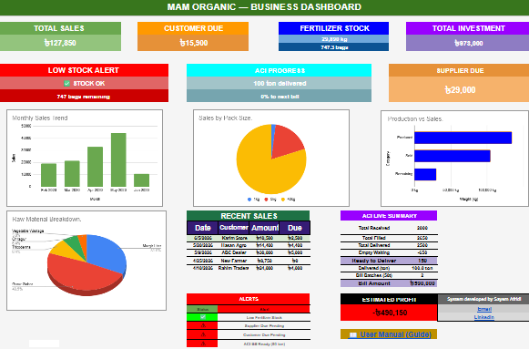
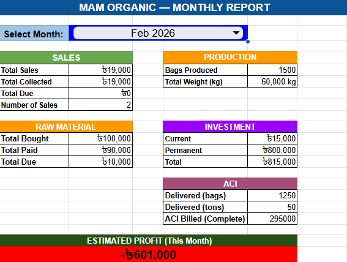
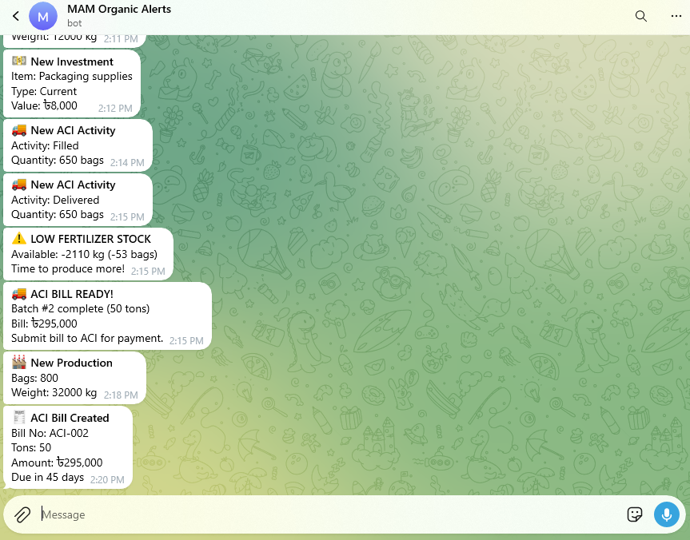
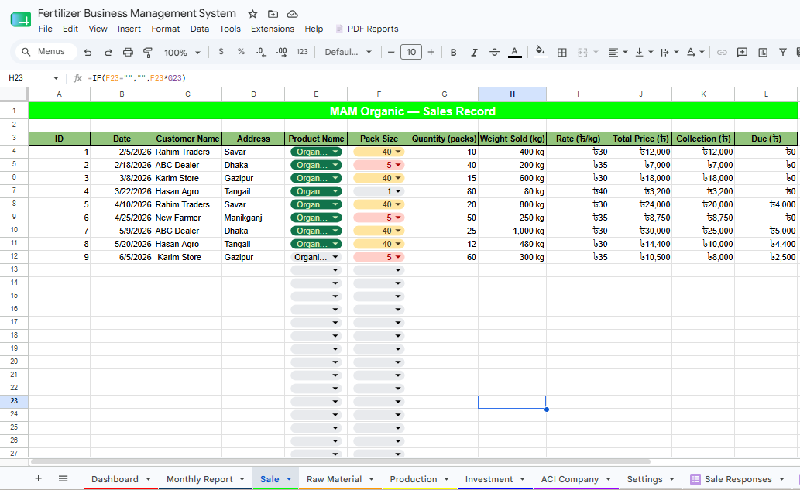

# 🌱 Organic Fertilizer ERP

> A complete, automated business-management system (ERP) for an organic fertilizer manufacturer — built entirely with **Google Sheets + Google Apps Script**, with **no external server or database**.


---

## 📋 Overview

**Organic Fertilizer ERP** is a real-world client project that replaced a fertilizer manufacturer's paper-based record-keeping with a fully automated digital system.

The business owner now runs his entire operation — sales, inventory, production, procurement, and a complex B2B billing relationship — from his phone, without ever touching a spreadsheet or knowing a single formula. Data goes in through simple forms; the system handles all calculations, alerts, reporting, and record-keeping automatically.

It performs the core functions of an enterprise ERP — **inventory, sales, procurement, production, and billing** — but is built on free, lightweight tools that require zero infrastructure to run.

---

## 🖼️ Screenshots

> _Screenshots of the live system (with demo data)._

### Dashboard
<!-- Add your dashboard screenshot here -->

*Live KPI cards, charts, alerts, and estimated profit — updates automatically.*

### Monthly Report
<!-- Add your monthly report screenshot here -->

*Pick any month and see a full financial summary instantly.*

### Telegram Alerts
<!-- Add your Telegram alerts screenshot here -->

*Real-time notifications for sales, low stock, and payment reminders.*

### Data Sheets
<!-- Add a screenshot of one of the sheets here -->

*Clean, auto-calculating sheets — populated entirely through forms.*

---

## ❗ The Problem

The owner of MAM Organic Fertilizer managed everything on paper:

- Sales, raw-material purchases, and production were tracked by hand
- Calculation mistakes were common, and customer/supplier dues were easy to lose track of
- A special supply relationship with **ACI Company** (a large corporate buyer) had complex rules — 50-ton minimum batches, VAT-adjusted pricing, and 45-day payment terms — that were hard to track manually, leading to missed or delayed payments
- He had no quick way to see how his business was actually performing

He needed a system that was **powerful but effortless to use** — something he could operate from his phone without any technical skill.

---

## ✨ Features

- 📱 **Phone-based data entry** — six Google Forms feed the system; the owner never edits the spreadsheet directly
- 📊 **Live dashboard** — auto-updating KPI cards, charts, alerts, and an estimated-profit calculation
- 🔔 **Real-time Telegram alerts** — instant notifications for every sale, low-stock warnings, and payment reminders
- 🏭 **Manufacturing inventory logic** — finished-goods stock correctly derived from production minus sales and ACI deliveries
- 🚚 **Automated ACI B2B billing** — 50-ton batch detection, VAT-adjusted pricing, automatic 45-day payment tracking, and "bill ready / payment due" alerts
- 📅 **Month-filtered reporting** — pick any month and get a complete financial summary
- 📄 **One-click PDF exports** — generate records for any sheet and month, auto-organized into Google Drive folders
- ⚙️ **Single source of truth** — all rates, thresholds, and settings centralized so business rules change with one edit
- 📖 **Bilingual documentation** — a 22-page Bangla user manual for the owner and full English technical docs

---

## 🛠️ Tech Stack

| Technology | Role |
|------------|------|
| **Google Sheets** | Data storage, formulas, dashboard, reports |
| **Google Apps Script** (JavaScript) | Automation, form sync, alerts, PDF export |
| **Google Forms** | Mobile data entry (6 forms) |
| **Telegram Bot API** | Real-time notifications |
| **Google Drive API** | Automated PDF storage |

---

## 🔄 How It Works

```
[ Owner's phone ]
        |  fills a Google Form
        v
[ Google Form ]  --->  [ "Responses" tab ]   (raw dump)
                              |
                              |  one on-form-submit trigger
                              v
                 [ Router: onAnyFormSubmit(e) ]
                              |  detects which form
                              v
            [ Correct handler writes a clean row ]
                              |
              +---------------+----------------+
              |                                |
     formulas recalculate              smart alerts fire
              |                                |
              v                                v
   [ Dashboard + Monthly Report ]   [ Telegram notifications ]

[ Daily timer ] ---> payment-due + monthly due reminders
[ Sheet menu ]  ---> one-click PDF reports to Drive
```

A single router function dispatches all six forms to the right handler, calculations live in the sheets, and Apps Script ties everything together — alerts, billing, and exports.

---

## 🧩 Key Engineering Challenges Solved

This was more than wiring forms to a sheet. A few of the real problems solved during the build:

- **One router, not many triggers** — A Google Sheets *on-form-submit* trigger fires for **every** linked form. With one handler per form, all six fired on every submission and scrambled the data. Solved with a single router that inspects which response tab received the data and dispatches to exactly one handler.
- **Reliable row insertion** — `getLastRow()` returned row 1000 because formulas filled the column, so new entries landed past the data. Replaced with a function that finds the last real record by ID.
- **Floating-point billing bug** — `6.10 − 0.20` stored as `5.8999…`, producing bills like ৳294,999.99. Fixed at the source with rounding in the central settings.
- **Idempotent alerts** — Used Apps Script's `PropertiesService` as persistent flags so alerts (low stock, ACI batch ready, 7-day payment due) fire **once per event**, not repeatedly.
- **Robust month filtering** — `MONTH()` crashed on blank cells in a range; switched to a `TEXT(date,"yyyy-mm")` matching method that handles real-world messy data.

> 📘 The full technical breakdown is in the [Developer Documentation](docs/Developer_Documentation.pdf).

---

## 📁 Project Structure

```
organic-fertilizer-erp/
├── README.md
├── apps-script/
│   ├── Telegram.gs          # messaging + error reporting
│   ├── FormSync.gs          # form → sheet router + ACI billing
│   ├── SmartAlerts.gs       # low-stock & ACI-bill-ready alerts
│   ├── ScheduledAlerts.gs   # daily payment & monthly due reminders
│   └── PDFExport.gs         # PDF report menu + Drive export
├── docs/
│   ├── Developer_Documentation.pdf
│   └── User_Manual_Bangla.pdf
└── screenshots/
    ├── dashboard.png
    ├── monthly-report.png
    ├── telegram-alerts.png
    └── sheets.png
```

---

## 📚 Documentation

- **[Developer Documentation](docs/Developer_Documentation.pdf)** — full technical reference: architecture, sheet structures, formulas, Apps Script code, triggers, and maintenance guide.
- **[User Manual](docs/User_Manual_Bangla.pdf)** — a complete, non-technical guide written for the business owner.

---

## 👤 Author

**Sayem Afridi** — CSE student & software developer

- 🔗 LinkedIn: [linkedin.com/in/sayem-afridi](https://www.linkedin.com/in/sayem-afridi)
- 📧 Email: sayemafridi110abc@gmail.com

---

> _Built as a real client project for MAM Organic Fertilizer. A demonstration of delivering enterprise-style business automation with lightweight, accessible tools._
